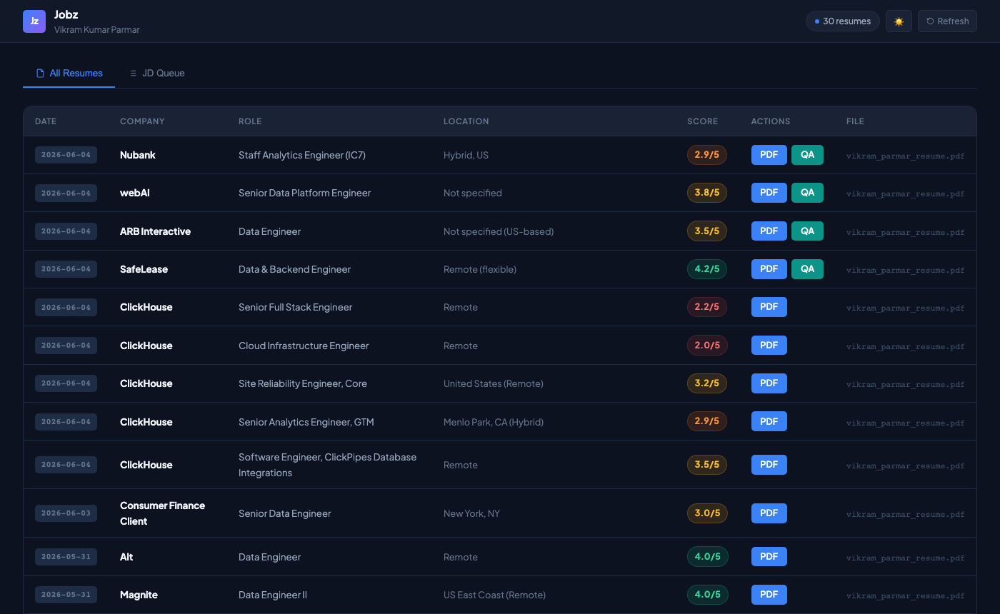
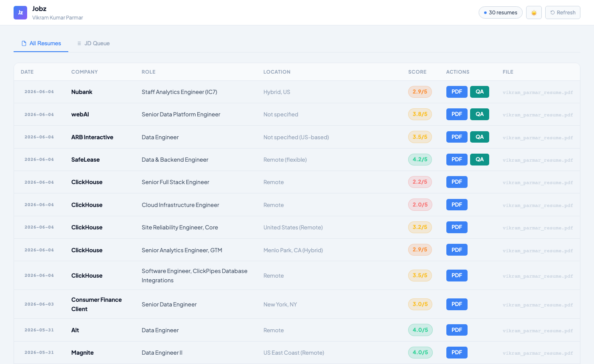

# Jobz

AI-powered job search pipeline — evaluate offers, generate tailored LaTeX resumes, track applications, and answer application questions — all from your terminal.

<p align="center">
  
</p>
<p align="center">
  
</p>

---

## What It Does

- **Evaluates job offers** with a structured A-F scoring system (10 weighted dimensions)
- **Generates tailored PDFs** — LaTeX resumes customized per job description via Tectonic
- **Web dashboard** (`localhost:3131`) — dark/light theme, JD queue, live processing, QA answer generation
- **QA page** — paste application questions, get streaming Claude answers grounded in your resume + the JD
- **Scans portals** automatically (Greenhouse, Ashby, Lever)
- **Tracks everything** in a single source of truth

---

## Stack

- **Node.js** — all scripts (`.mjs`)
- **Claude Code / `claude -p`** — AI evaluation and resume tailoring
- **Tectonic** — LaTeX → PDF compiler
- **Playwright** — portal scraping
- **Pure HTML/CSS/JS** — web dashboard (no build tools)

---

## Setup

```bash
# 1. Clone and install
git clone https://github.com/markiv25/jobz.git
cd jobz
npm install

# 2. Install Tectonic (LaTeX compiler)
brew install tectonic       # macOS
# or: https://tectonic-typesetting.github.io/en-US/install.html

# 3. Copy config templates
cp config/profile.example.yml config/profile.yml
cp templates/portals.example.yml portals.yml

# 4. Add your resume
# Create cv.md in the root with your experience, skills, and metrics

# 5. Copy the LaTeX template
cp templates/cv-template.tex templates/my-resume.tex
# Edit to match your design
```

---

## Running the Dashboard

### Foreground (development)

```bash
node resume-server.mjs
```

Opens at **http://localhost:3131**. Logs print to the terminal. Stop with `Ctrl+C`.

### Background with nohup (keep running after terminal closes)

```bash
nohup node resume-server.mjs > data/server.log 2>&1 &
echo $! > data/server.pid
echo "Jobz running at http://localhost:3131 (PID $(cat data/server.pid))"
```

**Check if it's running:**
```bash
curl -s http://localhost:3131/ | grep -o "Jobz" && echo "up" || echo "down"
```

**View logs:**
```bash
tail -f data/server.log
```

**Stop it:**
```bash
kill $(cat data/server.pid) && rm data/server.pid
```

### Auto-restart on reboot (launchd, macOS)

Create `~/Library/LaunchAgents/com.jobz.server.plist`:

```xml
<?xml version="1.0" encoding="UTF-8"?>
<!DOCTYPE plist PUBLIC "-//Apple//DTD PLIST 1.0//EN" "http://www.apple.com/DTDs/PropertyList-1.0.dtd">
<plist version="1.0">
<dict>
  <key>Label</key>
  <string>com.jobz.server</string>
  <key>ProgramArguments</key>
  <array>
    <string>/usr/local/bin/node</string>
    <string>/path/to/jobz/resume-server.mjs</string>
  </array>
  <key>RunAtLoad</key>
  <true/>
  <key>StandardOutPath</key>
  <string>/path/to/jobz/data/server.log</string>
  <key>StandardErrorPath</key>
  <string>/path/to/jobz/data/server.log</string>
</dict>
</plist>
```

```bash
launchctl load ~/Library/LaunchAgents/com.jobz.server.plist
```

---

## CLI Usage

With Claude Code open in the `jobz` directory:

```
/jobz oferta     # evaluate a job posting
/jobz pdf        # generate a tailored PDF
/jobz scan       # scan portals for new listings
/jobz pipeline   # process pending URLs from inbox
/jobz tracker    # view application status
/jobz apply      # fill out an application form
/jobz deep       # deep company research
```

### PDF Generation (direct)

```bash
node get-resume-n.mjs                                              # prints next N
node generate-pdf-latex.mjs /tmp/resume.tex output/resume_N.pdf   # compile
```

---

## Key Files

| File | Purpose |
|------|---------|
| `resume-server.mjs` | Web dashboard (Jobz UI) |
| `queue-worker.mjs` | JD queue processor + PDF compiler |
| `generate-pdf-latex.mjs` | LaTeX → PDF via Tectonic |
| `get-resume-n.mjs` | Atomic resume counter |
| `scan.mjs` | Zero-token portal scanner |
| `templates/cv-template.tex` | LaTeX resume template |
| `modes/` | AI prompt modes (evaluation, pdf, apply, scan…) |
| `data/applications.md` | Application tracker |
| `config/profile.example.yml` | Profile template |

---

## Credits

The backend of this project — offer evaluation engine, A-F scoring system, portal scanning (Greenhouse / Ashby / Lever), batch processing, tracker integrity checks, and all AI prompt modes — was built by **[Santiago Fernández de Valderrama (santifer)](https://github.com/santifer)** and released open source in **[santifer/career-ops](https://github.com/santifer/career-ops)**.

If this tool helps your job search, go ⭐ the original repo.

**What this fork adds:**
- LaTeX/Tectonic PDF pipeline (`generate-pdf-latex.mjs`) — preserves exact resume design without touching preamble or layout
- **Jobz web dashboard** (`resume-server.mjs`) — dark/light theme, stat chips, score badges, JD queue with live progress
- **QA page** — split-pane interface, paste application questions, streaming Claude answers grounded in your resume + the specific JD
- Atomic resume counter (`get-resume-n.mjs`) safe for parallel workers

Built on top of santifer's work by [Vikram Parmar](https://github.com/markiv25).

---

## License

MIT
